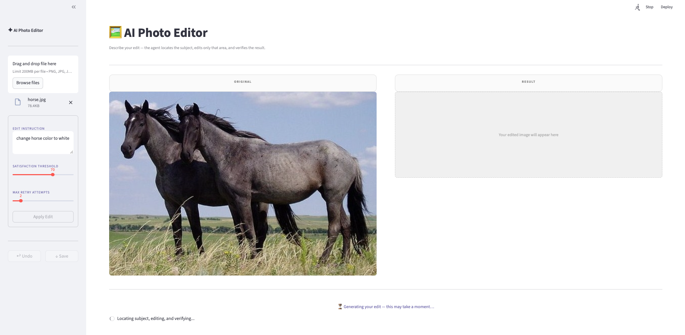
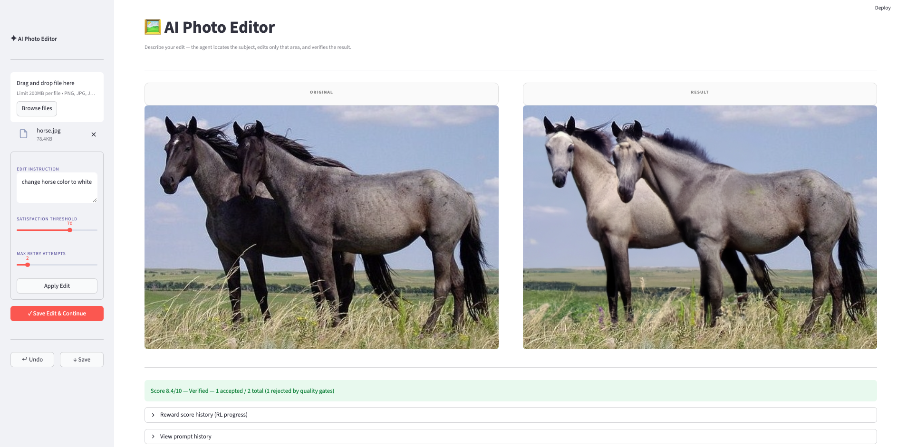

# AI Photo Editor

A Streamlit app that uses a **LangGraph agentic workflow** to apply natural-language edits to photos. Describe what you want changed - the agent locates the subject, generates the edit with DALL-E 2, scores the result, and retries automatically until the edit meets your satisfaction threshold.

**Live demo:** [claude24-ai-image-editor.streamlit.app](https://claude24-ai-image-editor.streamlit.app/)

---

## Screenshot

### Before & After

| Before | After |
|:---:|:---:|
|  |  |

_Prompt: "change the horse color to white" — original horse photo (left) and the AI-edited result (right)._

_Original horse photo from [Wikipedia — Horse](https://en.wikipedia.org/wiki/Horse)._

---

## Features

- **Natural-language edits** — describe the change in plain English (e.g. "change the background to white", "add a saddle on top of the horse")
- **Automatic subject detection** — GPT-4o identifies the primary subject's bounding box and determines whether the edit targets the subject or the background
- **Targeted inpainting** — a pixel-precise mask is generated so DALL-E 2 only edits the requested region
- **RL-style retry loop** — results are scored on three axes (edit quality, area preservation, realism); the agent refines its prompt and tightens its mask on each retry
- **Satisfaction threshold** — you set the minimum score (10–100%) required to accept a result; below-threshold results are shown in red as a preview
- **Edit history** — every accepted edit is saved; restore any previous version with one click
- **Save & Continue** — chain multiple edits together on the same image

---

## How It Works

### Agent Workflow (LangGraph)

```
rephrase_prompt
      ↓
   prepare          ← GPT-4o detects subject bbox + edit direction
      ↓
    edit             ← DALL-E 2 inpainting with subject mask
      ↓
    score            ← GPT-4o scores edit / preservation / realism (0–10 each)
      ↓
 should_retry?
   ├── done  →  END
   └── refine → update_mask → refine_prompt → edit  (loop)
```

### Scoring & Acceptance

Each DALL-E call is evaluated by GPT-4o on three dimensions:

| Dimension | Weight | Description |
|---|---|---|
| `edit_score` | 50% | How well the instruction was applied to the target area |
| `preservation_score` | 30% | Did non-target areas stay unchanged? |
| `realism_score` | 20% | Is the result visually coherent and artifact-free? |

**Hard gates** (both must pass or the attempt is rejected outright):
- `realism_score ≥ 4.0`
- `preservation_score ≥ 4.0`

The composite score is: `0.5 × edit + 0.3 × preservation + 0.2 × realism`

The workflow stops when:
- the best composite score ≥ satisfaction threshold, **or**
- accepted attempts reach the configured max, **or**
- total DALL-E calls reach `max_attempts × 4` (safety cap)

### Mask Convention (DALL-E 2)

| Alpha value | Meaning |
|---|---|
| Transparent (α = 0) | Edit this area |
| Opaque (α = 255) | Preserve this area |

- **Subject edit** (e.g. "change horse color"): subject bbox → transparent; background → opaque
- **Background edit** (e.g. "change background to white"): background → transparent; subject bbox → opaque

Images are padded to 1024 × 1024 with a **neutral gray** border before being sent to DALL-E, so that prompts like "change background to white" cannot be trivially satisfied by the white padding.

---

## Design Notes

### Why LangGraph?
LangGraph provides explicit control over the retry loop — each node (rephrase, prepare, edit, score, update\_mask, refine\_prompt) is a discrete step. This makes it easy to add, remove, or swap nodes, and gives full visibility into which step failed.

### Why an RL-style reward loop?
A single DALL-E call rarely produces a perfect edit. By scoring each result and using the feedback to (a) tighten the mask to only the still-incorrect region and (b) rewrite the prompt to address specific deficiencies, the agent hill-climbs toward a better result across retries.

### Why GPT-4o for scoring instead of a pixel diff?
Pixel diffs cannot distinguish between "the background changed correctly" and "the background changed incorrectly." GPT-4o can evaluate semantic correctness — whether the right thing changed, whether the subject is preserved, and whether the result looks realistic.

### Prompt engineering
User prompts are rewritten before the first DALL-E call. The rewrite:
- Converts action descriptions ("change X to Y") into appearance descriptions ("X rendered as Y, photorealistic")
- Adds specificity about color, texture, lighting, and style
- Stays under DALL-E 2's 400-character limit

On each retry, the prompt is refined to address only the parts still wrong according to the scorer's feedback, rather than restating the full instruction.

### Padding neutrality
The original implementation padded images to 1024 × 1024 with white. For prompts that involve making things white (e.g. "change background to white"), the white padding inflated GPT-4o's scores because the border trivially satisfied the instruction. Changing the pad to neutral gray (128, 128, 128) removes this bias.

---

## Setup

### Prerequisites
- Python 3.10–3.12
- OpenAI API key with access to `gpt-4o` and `dall-e-2`

### Install

```bash
cd src/project2
pip install -r requirements.txt
```

### Configure

Create `.env`:

```
OPENAI_API_KEY=sk-...
```

### Run

```bash
streamlit run app.py
```

---

## Usage

1. **Upload** a photo (PNG, JPG, JPEG) using the sidebar
2. **Describe** your edit in the text box (e.g. "change the horse color to white")
3. Adjust **Satisfaction Threshold** (default 70%) — higher means stricter
4. Adjust **Max Retry Attempts** (default 2) — how many accepted attempts before giving up
5. Click **Apply Edit**
6. If the result meets the threshold it is shown in the Result panel; if not, the best attempt is shown in red with its score
7. Click **✓ Save Edit & Continue** to commit the result and start a new edit on top of it
8. Use **↩ Undo** to revert to the previous image, or click **Restore** in the history strip

---

## Acknowledgements

[Claude Code](https://claude.ai/claude-code) (Anthropic's CLI) was used to assist with debugging during development.

---

## File Structure

```
src/project2/
├── app.py                # Streamlit app + LangGraph workflow
├── example/
│   ├── horse.jpg         # Original 
│   ├── beginning.png     # Before 
│   └── after_edit.png    # After 
├── .env                  # API keys (not committed)
├── .gitignore
├── requirements.txt      # Python dependencies
└── README.md
```
